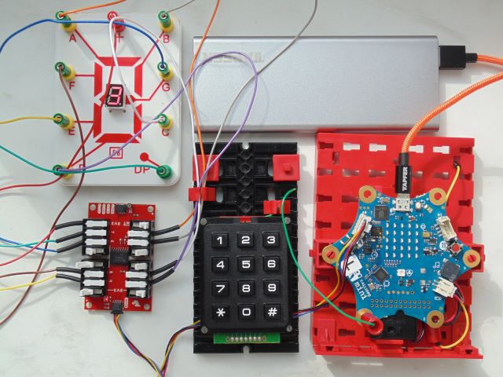

Diese Seite bei [https://calliope-net.github.io/i2c-keypad-gpio-7segment/](https://calliope-net.github.io/i2c-keypad-gpio-7segment/) öffnen.

### i2c Module an Calliope anstecken.

* [SparkFun Qwiic Keypad - 12 Button](https://www.sparkfun.com/products/15290)
* [SparkFun Qwiic GPIO](https://www.sparkfun.com/products/17047)
* 7-Segment-Anzeige ist nicht erhältlich

Kabel und Adapter

* [Qwiic Cable - Grove Adapter](https://www.sparkfun.com/products/15109)
* [Qwiic Cable Kit](https://www.sparkfun.com/products/15081)

Alle i2c Module werden parallel am linken Grove Steckverbinder A0 angeschlossen. 
i2c Module mit zwei Buchsen (z.B. Qwiic) können hintereinander gesteckt werden.

Für die Stromversorgung sollte Calliope über USB Kabel (an Computer oder Powerbank) angeschlossen sein.

#### .hex-Datei direkt auf Calliope laden, oder in MakeCode importieren.

* [mini-i2c-keypad-gpio-7segment.hex](mini-i2c-keypad-gpio-7segment.hex)
* [Schnappschuss (Bildschirmfoto mit den Blöcken)](mini-i2c-keypad-gpio-7segment.png)

#### Dieses Projekt von GitHub importieren, bearbeiten, mit Calliope testen.

Um dieses Repository in MakeCode zu importieren.

* öffne [https://makecode.calliope.cc](https://makecode.calliope.cc)
* klicke auf **Importieren** und dann auf **Importiere URL**
* kopiere die folgende **URL des Projekts** in die Zwischenablage (Strg-C)
* **calliope-net/i2c-keypad-gpio-7segment**
* füge sie auf der MakeCode Webseite ein (Strg-V) und klicke auf **Los geht's!**

### Bedienung der Calliope-App 'i2c-keypad-gpio-7segment'.

**GPIO** bedeutet: 'General-purpose input/output'. Alle 8 Ports sind als OUT konfiguriert. 
Nach Drücken einer Taste auf dem KeyPad wird die entsprechende Ziffer in der 7-Segment-Anzeige angezeigt. Eine Funktion zur 7-Segment-Codierung ist in der Erweiterung calliope-net/8io-qwiicgpio enthalten.
**Hardware-Interrupt** ist mit Calliope Pin 1 verdrahtet und löst die Abfrage der Taste aus. Das KeyPad speichert mehrere Tastendrücke, bis sie vom Programm abgeholt wurden.

### Erweiterungen

Die Calliope-App 'i2c-keypad-gpio-7segment' lädt folgende Erweiterungen:

* [https://github.com/calliope-net/bit](https://calliope-net.github.io/bit/)
* [https://github.com/calliope-net/keypad](https://calliope-net.github.io/keypad/)
* [https://github.com/calliope-net/gpio](https://calliope-net.github.io/gpio/)

> [Upates für Erweiterungen; Erweiterungen aus einem Projekt löschen.](https://calliope-net.github.io/i2c-liste#updates)

> [Alle i2c-Erweiterungen für MakeCode von calliope-net (Software).](https://calliope-net.github.io/i2c-liste#erweiterungen)

#### Calliope-Apps, .hex-Dateien, Bildschirmfotos mit Blöcken

> [Alle Beispiel-Projekte für MakeCode von calliope-net (Calliope-Apps).](https://calliope-net.github.io/i2c-liste#programmierbeispiele)

> GitHub-Profil calliope-net: [https://github.com/calliope-net](https://github.com/calliope-net)

### Bezugsquellen

> [Alle i2c-Module und Bezugsquellen (Hardware).](https://calliope-net.github.io/i2c-liste#bezugsquellen)

#### Metadaten (verwendet für Suche, Rendering)

* Calliope mini
* i2c
